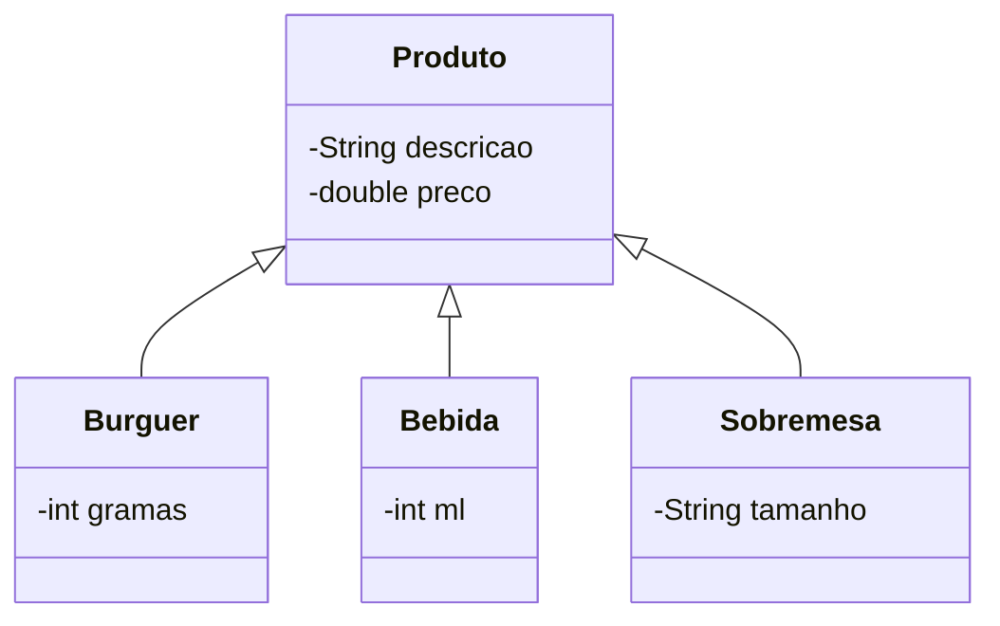
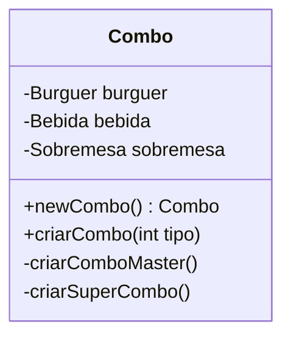

# Facade Design Pattern

Exercício para a aula de Engenharia de Software III - FATEC Baixada Santista

## Objetivo

> Usando as classes abaixo como modelo, implemente uma classe “Combo” seguindo o design pattern “Facade”.
>
> A classe implementada por você deverá ter um método que permita facilmente a criação de “combos” que incluam um sanduiche (burguer), uma sobremesa e bebida do “combo”.
> Deverá também ter um método para mostrar quais são os itens do “combo”.
>
> Se julgar necessário crie outras classes auxiliares.

### Classes

## Metodologia

Este exercício foi implementado utilizando a linguagem [Go](https://go.dev/). Apesar de Go não ser estritamente orientada a objetos, o conceito de Facade foi implementado utilizando `structs` (ao invés de classes), exportando apenas os métodos considerados públicos.

### Public / Private em Go

Na linguagem Go não existem modificadores de acesso como `public` e `private`.

Para expôr métodos, structs, atributos, variáveis para serem acessados por outros `packages` (ou seja, públicos), os mesmos devem ser nomeados começando com letra maiúscula.

Caso o nome inicie com letra minúscula, o mesmo não será acessível de fora do `package` onde foi declarado (portanto, privado).

### Implementação

Os tipos `bebida`, `burguer` e `sobremesa` representam as classes correspondentes. Foram nomeados com letra minúscula de forma que não podem ser instanciados diretamente fora do `package combo`. Para criar instâncias destes tipos, deve-se utilizar o respectivo método construtor (`NewBebida()`, `NewBurguer()`, `NewSobremesa()`) estes, sim, são "públicos".

Todos os structs implementam a interface [Stringer](https://go.dev/tour/methods/17), pois possuem um método `String() string` associado.

#### Combo

O tipo que implementa a _Facade_ é o struct `combo`, responsável por criar diferentes tipos de combo ao criar instâncias dos tipos `burguer`, `bebida` e `sobremesa` com valores específicos para cada combo.

Diagrama da "classe" `combo`:

## Executar

Para executar o programa, rode o comando `go run main.go` na raiz do projeto.

Caso não tenha a linguagem Go instalada, poderá utilizar diretamente a versão compilada para linux, executando diretamente o binário `./main-linux-x86_64`.
